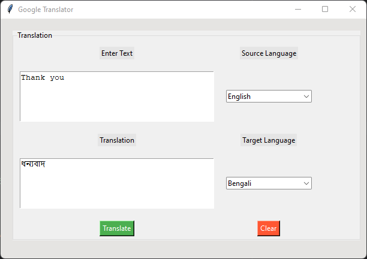

# Google Translator Using Python

Language Translator is a user-friendly Python application that leverages the power of Google Translate to help you effortlessly translate text from one language to another. Whether you need to translate a message, or a document, or explore different languages, this tool makes the process easy and intuitive.



## Features

- Text Translation: Enter the text you want to translate in the "Enter Text" field.
- Language Selection: Choose the source and target language from the dropdown menus.
- Translation: Click the "Translate" button to instantly see the translated text
- Clear Input: Use the "Clear" button to reset the input field and start fresh.
- Extensive Language Support: With a wide range of languages to choose from, you can translate between numerous language pairs.

## Requirements

1. Install the required packages:

```bash
pip install translate 
```

## Contributing
If you'd like to contribute to this project, please follow these steps:

- Fork the repository.
- Create a new branch for your feature or bug fix.
- Make your changes and test them.
- Commit your changes with descriptive commit messages.
- Push your changes to your fork.
- Create a pull request to the main repository.


Feel free to contribute to this project by opening issues or submitting pull requests. I would greatly appreciate your input and contributions.

Happy translating! 🌍✨
